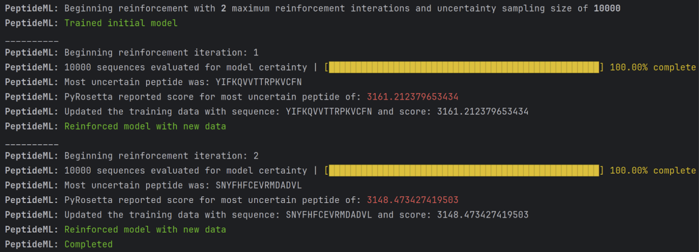

# ML Guided Protein Sequence Analysis
This repository contains a reinforcement learning Python script that uses Gaussian Process Regression (GPR) with a custom kernel for the analysis of peptide sequences.

## Dependencies
To run this script, make sure you have the following dependencies installed in your environment:
- Python 3.8 or higher
- PyRosetta
- Conda
  - Matplotlib
  - NumPy
  - Pandas
  - Scikit-Learn

## Description of the Script
This script utilizes **'GaussianProcessRegressor'** from Scikit-Learn library to model and predict binding affinities of peptide sequences from a given dataset. The script also introduces a custom sequence kernel that is used to compute the similarity between different peptide sequences.

## Key Features
1. **Custom Sequence Kernel:** The SequenceKernel class is a custom kernel that calculates a similarity score for each peptide sequence by comparing it with every other peptide sequence. This kernel is not stationary and is based on the idea that similar amino acids increase the similarity score.

2. **Feature Extraction:** Amino acid composition and molecular weight are extracted from peptide sequences using helper functions get_aa_composition() and get_molecular_weight().

3. **Model Training and Prediction:** The script trains a Gaussian Process Regressor on the peptide sequence dataset and uses the model to make binding affinity predictions.

4. **Reinforcement:** The trained model is used to make predictions on a sample of the vast peptide sequence space-- the most uncertain predictions are queued to be evaluated through _in silico_ simulation in PyRosetta, added to the training dataset and reinforced.
   
## File Structure
**'Data'** contains the training/testing/validation dataset used in model execution. **'VEGFR-ML'** contains the Regressor kernel files in __modelFiles.py__ and the reinforcement/training loop in __main.py__

## Future Work
Future enhancements to this script could include additional feature extraction techniques, testing alternative machine learning models, and providing more robust statistical analysis of the model's predictions.

## Credits
This script was created by Abdul Lateef FNU. Last modified: 4/24/2023.
Using scikit-learn library and documentation.
